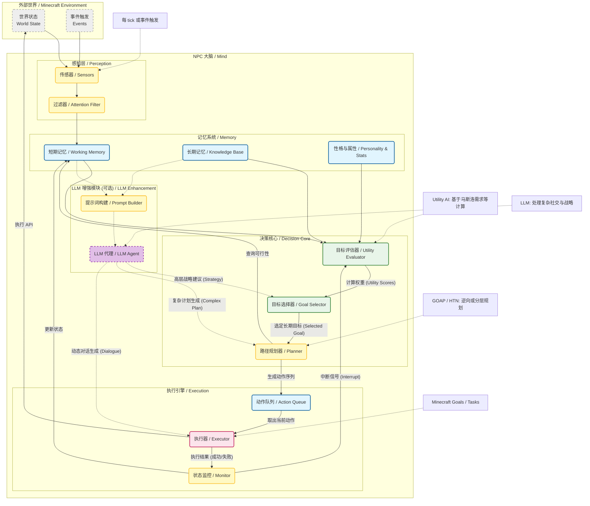

# 自主 NPC 系统架构设计图

这个流程图展示了 NPC 从感知环境到最终执行动作的完整数据流和决策过程，并包含了可选的 LLM 增强模块。

## 架构模块说明

### 1. 感知层 (Perception)
*   **Sensors (传感器)**: 负责从 Minecraft 世界获取原始数据。
    *   *视觉*: 扫描周围的方块、实体（玩家、怪物、掉落物）。
    *   *听觉*: 监听游戏内的声音事件（爆炸、脚步声）。
    *   *内省*: 读取自身的 NBT 数据（血量、灵力、饥饿度、Buff）。
*   **Filter (过滤器)**: 过滤掉无用信息，防止大脑过载。例如，忽略远处的无关实体，只关注威胁或资源。

### 2. 记忆系统 (Memory System)
*   **ShortTermMem (短期记忆)**: 存储当前上下文。
    *   "刚才谁打了我？"
    *   "附近哪里有灵石矿？" (最近一次扫描结果)
    *   "当前正在做什么任务？"
*   **LongTermMem (长期记忆)**: 存储持久化知识。
    *   "宗门的位置在哪里？"
    *   "这种草药有什么用？"
    *   "我对玩家 A 的好感度是多少？"
*   **Personality (性格)**: 静态配置，影响 Utility 计算的参数。
    *   *好战*: 战斗目标的权重加成更高。
    *   *谨慎*: 逃跑目标的权重加成更高。

### 3. LLM 增强模块 (LLM Enhancement - Optional)
*   **PromptBuilder (提示词构建)**: 将当前的记忆（短期+长期）和世界状态组装成自然语言 Prompt。
*   **LLM_Agent (LLM 代理)**: 调用外部大模型 API。
    *   **战略指导**: 当常规 Utility AI 陷入僵局或遇到未知情况时，LLM 可提供高层建议（如：“现在应该假装投降，伺机逃跑”）。
    *   **复杂规划**: 生成传统算法难以处理的非线性计划。
    *   **动态对话**: 生成符合当前情境和性格的 NPC 对话，而非死板的脚本。

### 4. 决策核心 (Decision Core)
*   **Evaluator (评估器)**: **这是大脑的核心**。它遍历所有可能的【长期目标】，根据当前【记忆】和【性格】计算每个目标的 Utility Score (效用分)。
    *   公式示例: `生存分 = (1 - 当前血量百分比) * 性格怕死系数`
*   **GoalSelector (选择器)**: 简单地选择分数最高的目标。如果 LLM 提供了强建议，可以覆盖常规评分。
*   **Planner (规划器)**: 负责将高层的“长期目标”（如“突破境界”）拆解为可执行的“动作序列”。
    *   *目标*: 突破境界
    *   *前置条件*: 需要灵气 > 1000
    *   *计划*: [寻找灵脉] -> [移动到灵脉] -> [打坐]

### 5. 执行引擎 (Execution Engine)
*   **ActionQueue (动作队列)**: 存放规划好的动作列表。
*   **Executor (执行器)**: 将抽象动作转换为 Minecraft 的具体指令 (Navigator, Attack, Interact)。如果是对话动作，则直接输出 LLM 生成的文本。
*   **Monitor (监控)**: 检查动作是否完成或失败。
    *   如果动作失败（路被堵住了），它会向决策层发送中断信号，触发重新规划。
