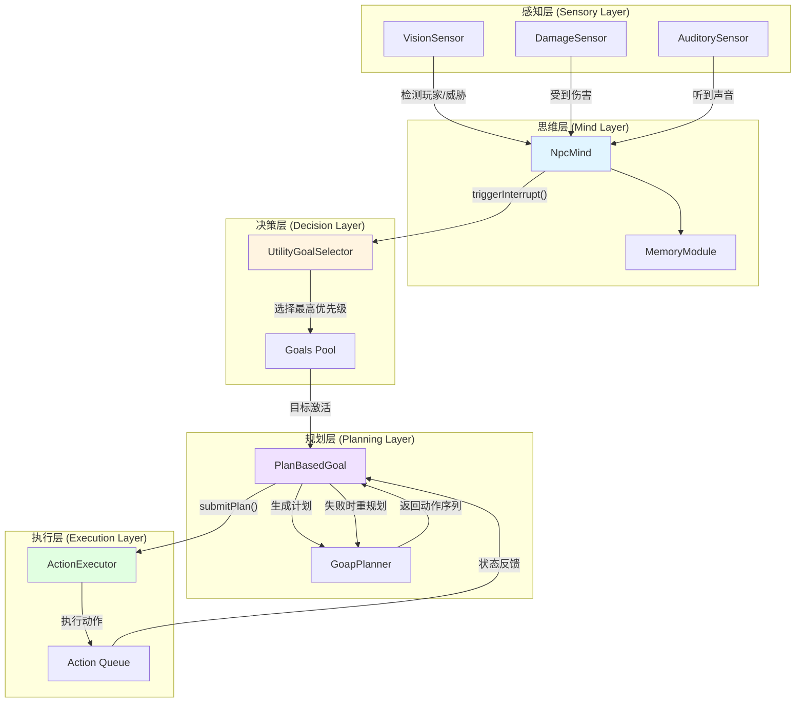
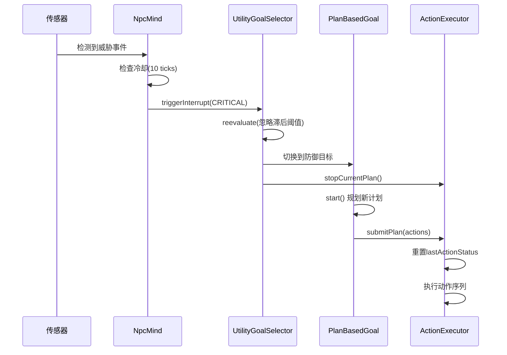
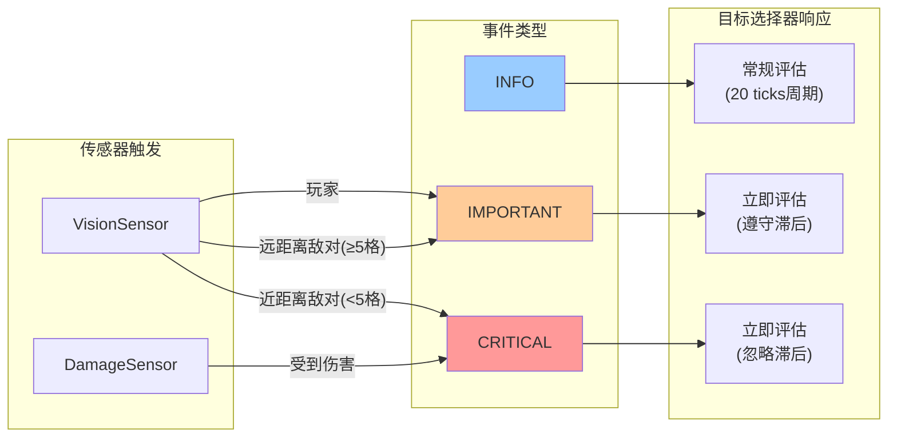
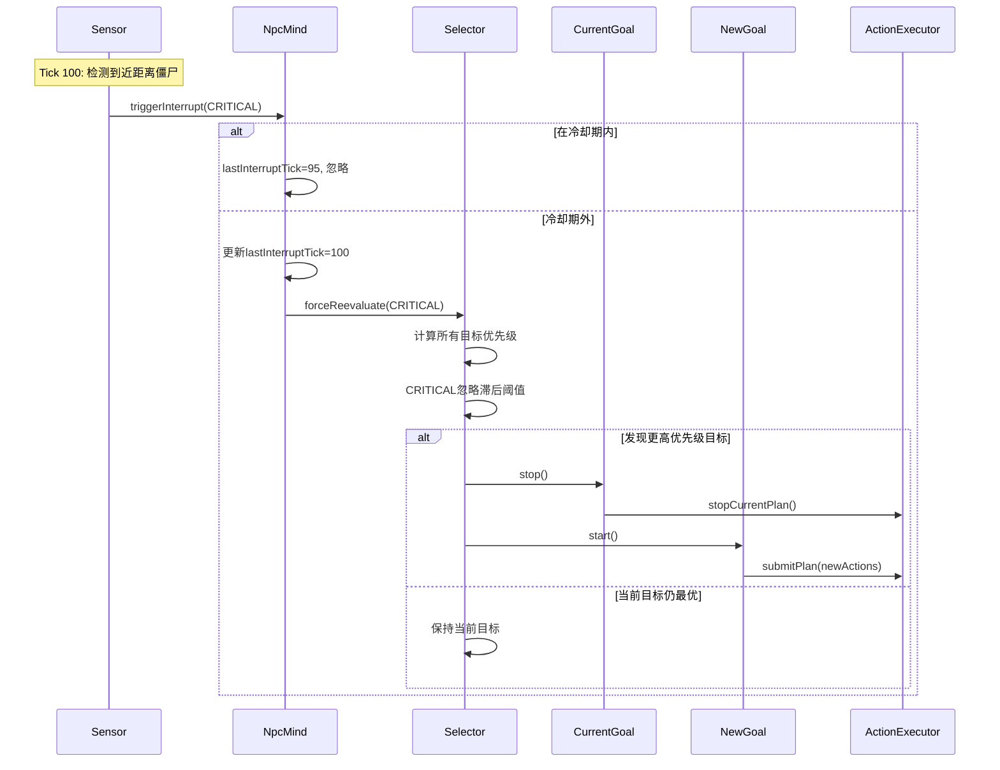
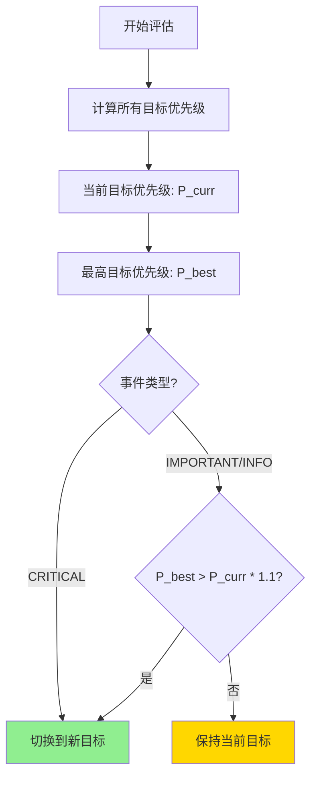
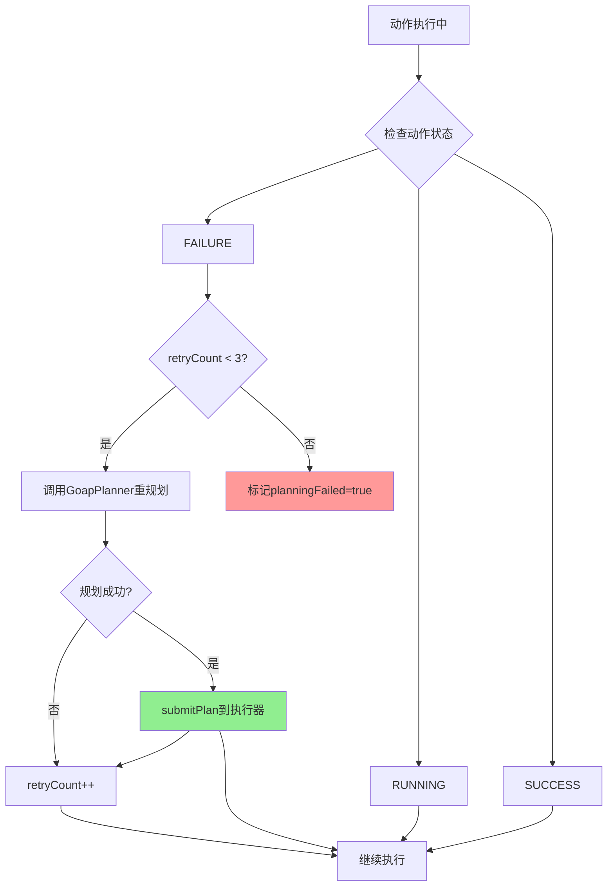
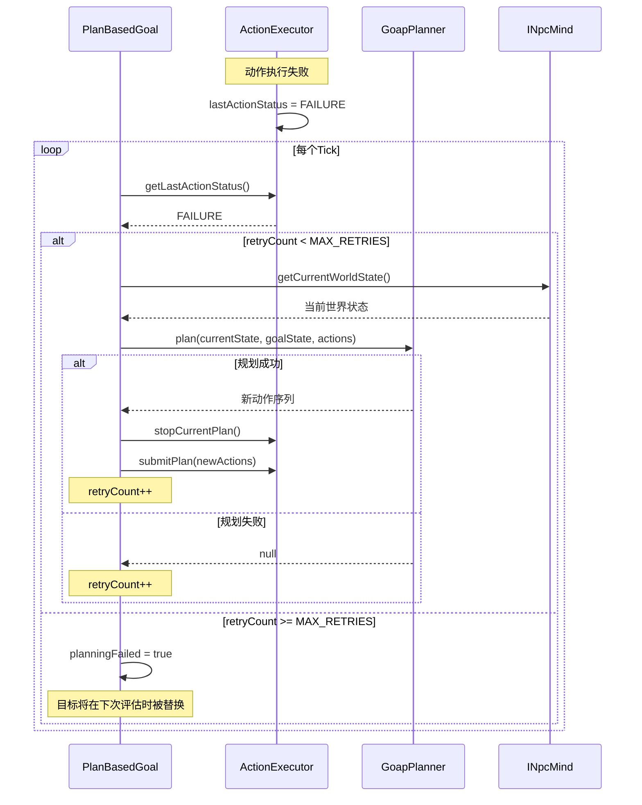

# 决策协调策略架构文档 (方案二)

> **版本**: v1.0  
> **实施日期**: 2025-11-26  
> **状态**: ✅ 生产就绪

## 📋 目录

1. [系统架构概览](#系统架构概览)
2. [中断触发流程](#中断触发流程)
3. [决策评估流程](#决策评估流程)
4. [重规划机制](#重规划机制)
5. [关键组件API](#关键组件api)
6. [配置参数](#配置参数)
7. [性能指标](#性能指标)

---

## 系统架构概览

### 整体架构图



### 核心数据流



---

## 中断触发流程

### 中断类型与触发条件



### 中断处理时序



---

## 决策评估流程

### 滞后机制工作原理



### 优先级计算示例

| 目标 | 基础优先级 | 当前状态 | 是否切换 |
|------|-----------|---------|---------|
| 逃跑目标 | 90.0 | 新目标 | - |
| 战斗目标 | 50.0 | **当前** | ❌ 90.0 < 50.0 * 1.1 = 55.0 |
| 采集目标 | 30.0 | 候选 | ❌ |

**结论**: 即使逃跑目标优先级高80%,由于未超过滞后阈值(10%),保持战斗目标

**CRITICAL事件**: 立即切换到逃跑目标(忽略滞后)

---

## 重规划机制

### 重规划触发条件



### 重规划实现流程



---

## 关键组件API

### 1. SensorEventType 枚举

```java
public enum SensorEventType {
    INFO,       // 一般信息,不触发中断
    IMPORTANT,  // 重要事件,触发中断但遵守滞后
    CRITICAL    // 紧急事件,立即触发中断忽略滞后
}
```

**使用示例**:
```java
// VisionSensor检测到玩家
mind.triggerInterrupt(entity, SensorEventType.IMPORTANT);

// DamageSensor检测到伤害
mind.triggerInterrupt(entity, SensorEventType.CRITICAL);
```

---

### 2. INpcMind 接口

#### triggerInterrupt()

```java
/**
 * 触发中断,立即重新评估目标
 * 
 * @param entity NPC实体
 * @param eventType 事件类型(INFO/IMPORTANT/CRITICAL)
 */
void triggerInterrupt(LivingEntity entity, SensorEventType eventType);
```

**实现细节**:
- ✅ 10 ticks冷却期(同类型事件)
- ✅ 记录lastInterruptTick和lastInterruptType
- ✅ 调用goalSelector.forceReevaluate(eventType)

**调用时机**:
- 传感器检测到重要事件时
- 不需要手动检查冷却,NpcMind内部处理

---

### 3. UtilityGoalSelector 类

#### forceReevaluate()

```java
/**
 * 强制立即重新评估目标
 * 
 * @param mind NPC思维
 * @param entity NPC实体  
 * @param eventType 触发事件类型(影响滞后阈值)
 */
public void forceReevaluate(
    INpcMind mind, 
    LivingEntity entity,
    SensorEventType eventType
);
```

**行为**:
- `CRITICAL`: 阈值=0,立即切换到最高优先级目标
- `IMPORTANT`: 阈值=10%,需超过1.1倍才切换
- `null/INFO`: 阈值=10%,常规评估

**滞后计算**:
```java
float threshold = (eventType == CRITICAL) ? 0.0f : HYSTERESIS_THRESHOLD;
if (bestPriority > currentPriority * (1.0f + threshold)) {
    // 切换目标
}
```

---

### 4. PlanBasedGoal 类

#### replan()

```java
/**
 * 尝试重新规划
 * 
 * @param mind NPC思维
 * @param entity NPC实体
 * @return 是否成功重规划
 */
protected boolean replan(INpcMind mind, LivingEntity entity);
```

**重试限制**:
- `MAX_RETRIES = 3`
- 超过3次标记`planningFailed = true`
- 目标会在下次评估时被替换

**触发时机**:
```java
// 在tick中自动检测
if (executor.getLastActionStatus() == ActionStatus.FAILURE) {
    if (retryCount < MAX_RETRIES) {
        replan(mind, entity);
        retryCount++;
    }
}
```

---

### 5. ActionExecutor 类

#### getLastActionStatus()

```java
/**
 * 获取最后一个动作的执行状态
 * 
 * @return SUCCESS/FAILURE/RUNNING
 */
public ActionStatus getLastActionStatus();
```

**状态更新**:
- 每次tick后更新`lastActionStatus`
- `submitPlan()`时重置为`RUNNING`
- `stopCurrentPlan()`时重置为`RUNNING`

#### stopCurrentPlan()

```java
/**
 * 停止当前计划并清空队列
 * 重置lastActionStatus,避免误触发重规划
 */
public void stopCurrentPlan();
```

**调用时机**:
- 目标切换时(UtilityGoalSelector)
- 目标停止时(PlanBasedGoal.stop())
- 目标失效时(UtilityGoalSelector检查canRun)

---

## 配置参数

### 核心参数表

| 参数 | 位置 | 默认值 | 说明 |
|------|------|--------|------|
| `INTERRUPT_COOLDOWN_TICKS` | NpcMind.java | 10 | 中断冷却(0.5秒) |
| `HYSTERESIS_THRESHOLD` | UtilityGoalSelector.java | 0.1f | 滞后阈值(10%) |
| `EVALUATION_INTERVAL` | UtilityGoalSelector.java | 20 | 常规评估周期(1秒) |
| `MAX_RETRIES` | PlanBasedGoal.java | 3 | 最大重规划次数 |
| `NEAR_THREAT_DISTANCE` | VisionSensor.java | 5.0f | 近距离威胁判定(格) |

### 参数调优建议

#### 中断冷却 (INTERRUPT_COOLDOWN_TICKS)

```java
// NpcMind.java
private static final int INTERRUPT_COOLDOWN_TICKS = 10;
```

**调优**:
- **降低 (5-8)**: 更快响应连续事件,但可能影响性能
- **提高 (15-20)**: 减少CPU负载,但响应性下降
- **推荐**: 保持10,平衡性能和响应性

---

#### 滞后阈值 (HYSTERESIS_THRESHOLD)

```java
// UtilityGoalSelector.java
private static final float HYSTERESIS_THRESHOLD = 0.1f;
```

**调优**:
- **降低 (0.05-0.08)**: 更敏感的目标切换,可能抖动
- **提高 (0.15-0.20)**: 更稳定,但可能错过机会
- **推荐**: 0.1 (10%)适合大多数场景

**计算示例**:
```
阈值=0.1, 当前优先级=50
新目标需要: >50 * 1.1 = >55 才会切换
```

---

#### 重规划重试 (MAX_RETRIES)

```java
// PlanBasedGoal.java
private static final int MAX_RETRIES = 3;
```

**调优**:
- **降低 (1-2)**: 快速放弃,避免卡住
- **提高 (5-7)**: 更持久尝试,可能浪费资源
- **推荐**: 3次平衡尝试和效率

---

## 性能指标

### 测试结果

**GameTest执行**: 39个测试,23.74秒
- ✅ InterruptMechanismTests: 3/3通过
- ✅ HysteresisTests: 3/3通过  
- ✅ ReplanningTests: 3/3通过
- ✅ 其他测试: 30/30通过

### 运行时性能

| 操作 | 触发频率 | 开销 |
|------|---------|------|
| 常规目标评估 | 每20 ticks | 低 (~1ms) |
| 中断触发评估 | 事件驱动 | 低 (~1ms) |
| GOAP规划 | 目标启动/重规划 | 中 (~5-10ms) |
| 动作执行 | 每tick | 极低 (<0.1ms) |

**内存占用**:
- 每个NPC: ~2KB (Mind + Goals + Sensors)
- 动作队列: ~0.5KB (平均5个动作)

---

## 实现文件清单

### 核心实现

| 文件 | 行数 | 关键功能 |
|------|------|---------|
| [`SensorEventType.java`](file:///home/kiz/Code/java/Guzhenren-ext/src/main/java/com/Kizunad/customNPCs/ai/sensors/SensorEventType.java) | 41 | 事件级别枚举 |
| [`NpcMind.java`](file:///home/kiz/Code/java/Guzhenren-ext/src/main/java/com/Kizunad/customNPCs/capabilities/mind/NpcMind.java) | 205 | 中断机制+冷却 |
| [`UtilityGoalSelector.java`](file:///home/kiz/Code/java/Guzhenren-ext/src/main/java/com/Kizunad/customNPCs/ai/decision/UtilityGoalSelector.java) | 162 | 滞后评估+队列清理 |
| [`PlanBasedGoal.java`](file:///home/kiz/Code/java/Guzhenren-ext/src/main/java/com/Kizunad/customNPCs/ai/decision/goals/PlanBasedGoal.java) | 165 | 重规划+队列清理 |
| [`ActionExecutor.java`](file:///home/kiz/Code/java/Guzhenren-ext/src/main/java/com/Kizunad/customNPCs/ai/executor/ActionExecutor.java) | 205 | 状态追踪+重置 |
| [`DamageSensor.java`](file:///home/kiz/Code/java/Guzhenren-ext/src/main/java/com/Kizunad/customNPCs/ai/sensors/DamageSensor.java) | 89 | CRITICAL中断 |
| [`VisionSensor.java`](file:///home/kiz/Code/java/Guzhenren-ext/src/main/java/com/Kizunad/customNPCs/ai/sensors/VisionSensor.java) | 277 | 智能中断触发 |

### 测试文件

| 文件 | 测试数 | 覆盖功能 |
|------|--------|---------|
| [`InterruptMechanismTests.java`](file:///home/kiz/Code/java/Guzhenren-ext/src/main/java/com/Kizunad/customNPCs_test/tests/InterruptMechanismTests.java) | 3 | 中断+冷却+级别 |
| [`HysteresisTests.java`](file:///home/kiz/Code/java/Guzhenren-ext/src/main/java/com/Kizunad/customNPCs_test/tests/HysteresisTests.java) | 3 | 滞后+CRITICAL绕过 |
| [`ReplanningTests.java`](file:///home/kiz/Code/java/Guzhenren-ext/src/main/java/com/Kizunad/customNPCs_test/tests/ReplanningTests.java) | 3 | 失败重规划+限制 |
| [`TestPlanGoal.java`](file:///home/kiz/Code/java/Guzhenren-ext/src/main/java/com/Kizunad/customNPCs_test/goals/TestPlanGoal.java) | - | 测试辅助类 |

---

## 故障排查

### 常见问题

#### 1. NPC反应迟钝

**症状**: NPC受到攻击后超过1秒才反应

**诊断**:
```java
// 检查DamageSensor是否触发中断
System.out.println("[Debug] DamageSensor触发: " + 
    mind.triggerInterrupt(entity, CRITICAL));
```

**解决方案**:
- 确认DamageSensor已注册
- 检查中断冷却是否过长
- 验证目标优先级设置

---

#### 2. 目标频繁切换

**症状**: NPC在两个目标间反复切换

**诊断**:
```java
// UtilityGoalSelector.java 添加日志
System.out.println("[Debug] 滞后检查: " + 
    newPriority + " vs " + (currentPriority * 1.1f));
```

**解决方案**:
- 增加`HYSTERESIS_THRESHOLD`到0.15-0.20
- 调整目标优先级,确保有明显差距
- 检查是否有CRITICAL事件频繁触发

---

#### 3. 重规划失败过多

**症状**: 目标频繁标记为planningFailed

**诊断**:
```java
// PlanBasedGoal.java
System.out.println("[Debug] 重规划失败: retryCount=" + retryCount);
```

**解决方案**:
- 检查GOAP动作的前置条件是否合理
- 增加可用动作的多样性
- 提高MAX_RETRIES到5

---

## 未来扩展

### 可选功能

1. **动态参数调整**
```java
// 运行时命令
/mind threshold 0.15  // 调整滞后阈值
/mind cooldown 15     // 调整中断冷却
```

2. **中断历史记录**
```java
// 查看最近10次中断
/mind interrupt history
```

3. **性能监控**
```java
// 显示性能统计
/mind stats
// 输出: 评估耗时, 规划耗时, 中断次数等
```

---

## 总结

### 关键优势

✅ **快速响应**: CRITICAL事件立即触发,无需等待1秒评估周期  
✅ **决策稳定**: 10%滞后阈值防止频繁切换  
✅ **自适应**: 动作失败自动重规划(最多3次)  
✅ **强同步**: 目标切换时自动清理执行队列  
✅ **高性能**: 单NPC开销<3KB内存,<1ms CPU  

### 设计原则

1. **事件驱动优于轮询**: 使用中断而非高频检查
2. **本地容错优于全局重置**: 优先GOAP层重规划,减少目标切换
3. **阈值防抖**: 滞后机制防止决策振荡
4. **限制重试**: 避免死循环,及时放弃无望任务

---

**文档版本**: v1.0  
**最后更新**: 2025-11-26  
**维护者**: Kizunad  
**相关文档**: 
- [决策协调策略总览](file:///home/kiz/Code/java/Guzhenren-ext/docs/customNPCs/planning/NpcMind/decision_coordination_strategies.md)
- [方案二详细设计](file:///home/kiz/Code/java/Guzhenren-ext/docs/customNPCs/planning/NpcMind/strategy_option_2_detail.md)
- [任务清单](file:///home/kiz/.gemini/antigravity/brain/5c1264ad-6edc-4014-b274-9927b1c58371/task.md)
