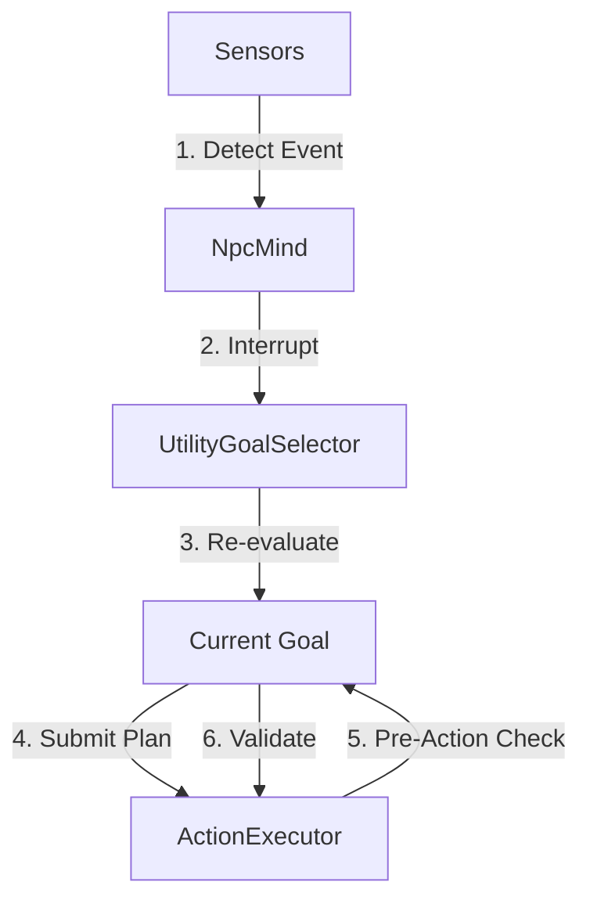
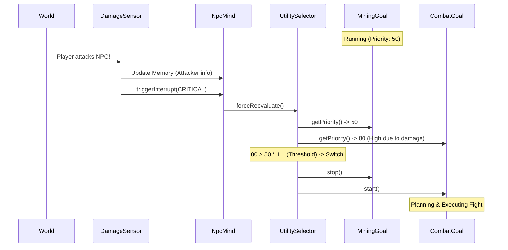

# 方案二详解：带中断的高频监控 (Interrupt-Driven Monitoring)

本方案旨在通过引入**事件驱动的中断机制**和**执行前的快速检查**，解决 NPC 在长周期规划中反应迟钝的问题，同时利用**滞后 (Hysteresis)** 机制防止决策抖动。

## 1. 核心架构概览

系统将从单纯的 "轮询 (Polling)" 模式转变为 "轮询 + 中断 (Polling + Interrupts)" 混合模式。

*   **常规状态**: `UtilityGoalSelector` 维持 1 秒 (20 ticks) 的低频评估，节省性能。
*   **突发事件**: 当 `Sensor` 感知到高威胁/高价值事件时，触发 **中断信号**。
*   **中断响应**: `NpcMind` 接收信号，立即强制 `UtilityGoalSelector` 进行一次评估。
*   **执行保护**: 在执行每个动作前，进行一次轻量级的 `Preconditions` 检查，确保计划仍然有效。



---

## 2. 组件设计详解

### 2.1 感知层：事件分级 (Sensor Impact Levels)

并非所有感知到的变化都需要打断当前计划。我们需要对感知事件进行分级。

**新增枚举**: `SensorEventType`
*   `INFO` (低): 普通信息更新（如发现掉落物），仅更新记忆，不触发中断。
*   `IMPORTANT` (中): 重要信息（如发现玩家），可能会改变决策。
*   `CRITICAL` (高): 紧急情况（如受到伤害、濒死），必须立即处理。

**接口变更**: `ISensor`
```java
public interface ISensor {
    void tick(INpcMind mind, LivingEntity entity);
    
    // 传感器内部逻辑示例:
    // if (damageReceived) {
    //     mind.getMemory().update(...)
    //     mind.triggerInterrupt(SensorEventType.CRITICAL);
    // }
}
```

### 2.2 决策层：滞后与冷却 (Hysteresis & Cooldowns)

为了防止 NPC 在两个分数相近的目标间反复横跳（例如：吃东西 50.1分 vs 战斗 50.0分），引入滞后机制。

**逻辑**:
只有当 `NewGoal.Score > CurrentGoal.Score * (1.0 + Threshold)` 时，才允许切换。

*   **Threshold (阈值)**: 建议默认 **10% (0.1)**。
*   **例外**: 如果触发中断的是 `CRITICAL` 级别事件，可以忽略阈值或使用更低的阈值。

**代码逻辑 (伪代码)**:
```java
public void reevaluate(INpcMind mind, LivingEntity entity, SensorEventType interruptLevel) {
    IGoal bestGoal = ...; // 计算最高分目标
    float bestScore = ...;
    
    float currentScore = currentGoal != null ? currentGoal.getPriority(...) : 0;
    
    // 动态阈值：紧急情况下更容易切换
    float threshold = 0.1f;
    if (interruptLevel == SensorEventType.CRITICAL) {
        threshold = 0.0f; // 紧急情况立即响应
    }
    
    // 滞后判断
    if (bestGoal != currentGoal) {
        if (bestScore > currentScore * (1.0f + threshold)) {
            switchGoal(bestGoal);
        }
    }
}
```

### 2.3 执行层：执行前检查 (Pre-Action Validation)

GOAP 生成的计划是一系列动作。在执行动作 A 时，环境可能变化导致动作 B 的前置条件不再满足。

**机制**:
`ActionExecutor` 在调用 `action.start()` 之前，先回调 `PlanBasedGoal.validateNextAction(action)`。

**流程**:
1.  `ActionExecutor` 准备执行 `MoveTo(Door)`。
2.  调用 `Goal.validateNextAction(MoveTo)`。
3.  Goal 检查 `MoveTo` 的 `Preconditions` (例如 `can_move: true`)。
4.  如果检查通过，继续执行。
5.  如果检查失败（例如脚下突然出现岩浆），Goal 返回 `false`。
6.  `ActionExecutor` 终止当前计划，报告 `FAILURE`。
7.  Goal 捕获 `FAILURE`，触发 **局部重规划** 或 **放弃目标**。

---

## 3. 交互时序图 (Sequence Diagram)

### 场景：NPC 正在采矿 (Mining)，突然受到攻击 (Attacked)



---

## 4. 实施步骤 (Implementation Steps)

1.  **定义事件类型**: 创建 `SensorEventType` 枚举。
2.  **增强 NpcMind**: 添加 `triggerInterrupt(SensorEventType type)` 方法。
3.  **更新 Sensors**: 修改 `DamageSensor` 和 `VisionSensor`，在关键事件时调用中断。
4.  **实现滞后**: 修改 `UtilityGoalSelector.reevaluate`，增加阈值逻辑。
5.  **实现执行前检查**:
    *   在 `PlanBasedGoal` 中添加 `boolean validateAction(IAction action)`。
    *   修改 `ActionExecutor` 在 `start()` 前调用验证。

## 5. 潜在风险与缓解

*   **风险**: `CRITICAL` 中断过于频繁（例如持续燃烧伤害），导致每一 tick 都重评估，性能下降。
*   **缓解**: 在 `NpcMind` 中添加 `InterruptCooldown` (例如 5-10 ticks)，防止同一类型的事件在短时间内连续触发中断。
