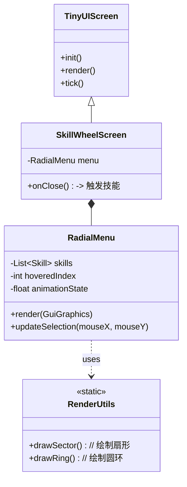

# TinyUI 轮盘菜单 (Radial Menu) 实现计划

## 1. 概述 (Overview)

本计划旨在基于 `TinyUI` 框架，为《古真人》模组实现一个高性能、视觉效果优秀的**技能轮盘菜单 (Skill Radial Menu)**。该菜单将利用 OpenGL 底层绘制技术（安全模式）实现扇形/圆环渲染，并提供流畅的“按住-选择-松开”交互体验。

**目标效果**：
*   按下快捷键（如 `R`）呼出透明背景轮盘。
*   鼠标滑动指向不同扇区，扇区高亮并放大显示技能图标。
*   松开按键立即释放对应技能（或点击释放）。
*   视觉风格契合“空窍/蛊虫”主题。

## 2. 架构设计 (Architecture)

### 2.1 核心组件结构

我们将扩展 `TinyUI` 的组件体系，引入专门处理极坐标布局的组件。



### 2.2 关键类定义

1.  **`com.Kizunad.tinyUI.util.RenderUtils`**
    *   **职责**：封装底层的 `Tesselator` 和 `BufferBuilder` 操作。
    *   **核心方法**：
        *   `drawSector(...)`: 使用 `TRIANGLE_FAN` 绘制带颜色的扇形。
        *   `drawTextureSector(...)`: (进阶) 绘制带纹理的扇形（用于特效）。
    *   **安全保障**：确保使用 `RenderSystem` 管理状态，并使用 `GuiGraphics` 的矩阵堆栈，防止与其他 Mod 冲突。

2.  **`com.Kizunad.tinyUI.component.RadialMenu`**
    *   **职责**：管理轮盘的数据和交互逻辑。
    *   **属性**：
        *   `radius`: 轮盘半径。
        *   `innerRadius`: 内圆半径（盲区）。
        *   `options`: 技能列表。
    *   **逻辑**：
        *   将 `(mouseX, mouseY)` 转换为 `(Angle, Distance)`。
        *   计算当前悬停的 `index`。
        *   处理高亮动画插值。

3.  **`com.Kizunad.guzhenrenext.client.gui.SkillWheelScreen`**
    *   **职责**：作为顶级 Screen 存在。
    *   **交互**：
        *   `init()`: 初始化 `RadialMenu` 组件并居中。
        *   `tick()`: 检查快捷键是否仍被按住。如果你松开快捷键 -> `onClose()` -> 发包。
        *   `isPauseScreen()`: 返回 `false` (不暂停游戏)。

## 3. 实现步骤 (Implementation Steps)

### 第一阶段：基础设施 (Infrastructure)
- [ ] **创建 `RenderUtils`**
    - 实现 `drawSector` 方法（纯色）。
    - 验证：在 `TinyUIDemoCommand` 中测试画一个扇形，确保缩放窗口时位置正确。

### 第二阶段：组件逻辑 (Component Logic)
- [ ] **创建 `RadialMenu` 组件**
    - 实现极坐标转换逻辑 (`Math.atan2`, `Math.sqrt`)。
    - 实现扇区索引计算算法。
    - 添加“中心盲区”检测 (Deadzone)，防止鼠标在圆心微小抖动导致误选。

### 第三阶段：渲染完善 (Rendering)
- [ ] **实现轮盘背景绘制**
    - 使用 `RenderUtils` 绘制半透明黑色背景。
    - 为当前 `hoveredIndex` 绘制高亮扇区（如白色高亮）。
- [ ] **实现图标渲染**
    - 计算每个扇区中心的 `(x, y)` 坐标。
    - 使用 `GuiGraphics.renderItem` 渲染蛊虫/技能物品。
    - 添加选中时的图标放大效果（Scale Matrix）。

### 第四阶段：交互与网络 (Interaction & Network)
- [ ] **创建 `SkillWheelScreen`**
    - 绑定按键事件 (KeyMapping)。
    - 实现“松开按键触发”逻辑。
- [ ] **网络通信**
    - 定义 `PacketCastActiveSkill` (C2S)。
    - 在 Screen 关闭或确认选择时发送数据包。

## 4. 详细技术规范 (Technical Specs)

### 4.1 数学计算
```java
// 角度修正：Minecraft 屏幕坐标系中，atan2(dy, dx) = 0 是 3 点钟方向。
// 我们通常希望 0 index 在 12 点钟方向 (-90度)。
double angle = Math.toDegrees(Math.atan2(mouseY - centerY, mouseX - centerX));
angle = (angle + 360) % 360; // 归一化 [0, 360)

// 旋转坐标系，使得 12 点钟为起始点
double viewAngle = (angle + 90) % 360;
int sectorIndex = (int) (viewAngle / (360.0 / totalSectors));
```

### 4.2 渲染优化
*   **多边形精度**：绘制圆弧时，每 `2-3` 度一个顶点即可，过高精度浪费性能。
*   **状态管理**：
    *   `RenderSystem.enableBlend()`
    *   `RenderSystem.defaultBlendFunc()`
    *   `RenderSystem.setShader(GameRenderer::getPositionColorShader)`

### 4.3 视觉风格 (Theme)
*   **普通状态**：背景色 `#80000000` (半透明黑)。
*   **高亮状态**：背景色 `#80FFFFFF` (半透明白) 或 `#80FFD700` (金光 - 契合古真人金行风格)。
*   **中心区域**：显示当前选中技能的名称和详细数值（消耗真元等）。

## 5. 待办事项列表 (Tasks)

- [ ] 实现 `com.Kizunad.tinyUI.util.RenderUtils.drawSector`
- [ ] 实现 `com.Kizunad.tinyUI.component.RadialMenu` 基础逻辑
- [ ] 集成到 `TinyUI` 演示指令中进行测试
- [ ] 关联 `GuzhenrenExt` 的技能数据接口
- [ ] 完成最终的 `SkillWheelScreen`
